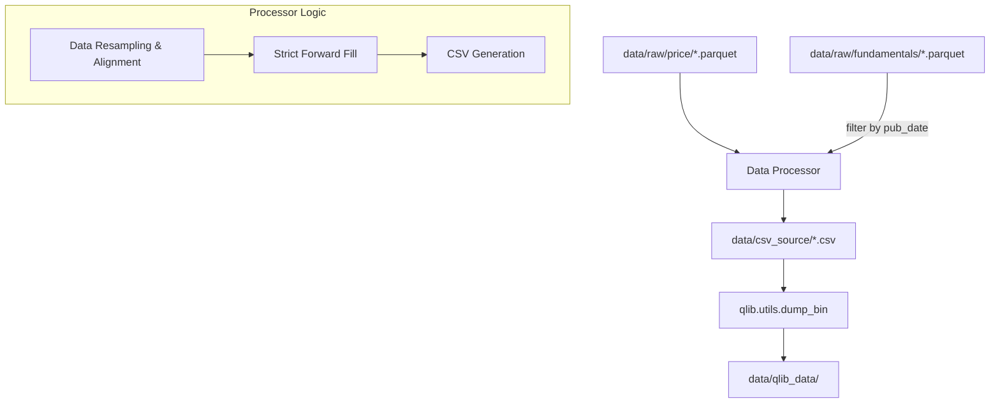

# Qlib 数据格式转换设计文档 (2026-03-26)

## 1. 概述 (Overview)
本项目旨在将从掘金 (GM SDK) 下载的各种 Parquet 格式数据（包括日线行情、每日估值、财务报表等）转换为 Qlib 专有的二进制格式 (`.bin`)。此环节是构建量化因子研究与机器学习流水线的核心步骤。

## 2. 设计目标 (Objectives)
- **多源数据整合**：将日线行情数据 (`price_*.parquet`) 与财务数据、估值数据进行对齐。
- **严谨的财务披露逻辑**：严格使用财务报表的“实际披露日期” (`pub_date`) 执行数据前向填充 (FFill)，杜绝回测中的“未来函数” (Look-ahead bias)。
- **高性能输出**：通过生成的 CSV 中间文件，利用 Qlib 的 `dump_bin` 工具生成二进制特征文件，以支持高速特征索引。
- **本地存储管理**：将转换后的 Qlib 数据存储在项目本地目录 `data/qlib_data`。

## 3. 系统架构 (Architecture)



### 3.1 核心组件
- **`QlibBinConverter` (Python Class)**:
  - 实现数据的读取、清洗、合并、填充以及输出 CSV。
- **`build_qlib_data.py` (CLI Script)**:
  - 整合整个流程的入口脚本。
- **`dump_bin` (Qlib Utility)**:
  - 核心转换工具。

## 4. 关键数据对齐逻辑 (Data Alignment Logic)

### 4.1 时间轴对齐
- **主时间轴 (Primary Calendar)**: 以行情数据中的交易日期为基准。
- **财务披露对齐**:
  - 财务指标（如 `total_ast`, `net_prof`）采用 `pub_date`（披露日期）作为合并键。
  - 在同一 `pub_date` 内可能有多次调整，系统将保留最新一条记录。
- **前向填充 (FFill)**: 
  - 所有非每日更新的数据字段均需在前向排序的序列上执行 `groupby('symbol').ffill()`。
  - 在披露前，数据必须保持为缺失状态（或填充之前的有效财报数据），不得使用报告期截止日 (`rpt_date`)。

### 4.2 字段映射 (Field Mapping)
| Qlib 兼容列名 | 功能描述 | 来源表 | 原始字段 |
|---|---|---|---|
| `date` | 时间戳 | price | `bob` (仅日期部分) |
| `open`/`high`/`low`/`close` | 价格数据 | price | `open`/`high`/`low`/`close` |
| `volume`/`amount` | 量价数据 | price | `volume`/`amount` |
| `pe_ttm`/`pb_lyr` | 估值因子 | trading_derivative_indicator | `pe_ttm`/`pb_lyr` |
| `total_ast`/`total_eqy` | 核心财务 | balance_sheet | `ttl_ast`/`ttl_eqy` |

## 5. 存储架构 (Storage Structure)
```
data/
├── csv_source/              # 临时 CSV 目录
│   ├── SH600000.csv
│   └── SZ000001.csv
└── qlib_data/               # 最终转换目录
    ├── calendars/           # 交易日历
    │   └── day.txt
    ├── instruments/         # 股票池列表
    │   └── all.txt
    └── features/            # 二进制特征
        └── SH600000/
            ├── close.day.bin
            ├── pe_ttm.day.bin
            └── ...
```

## 6. 后续计划 (Next Steps)
1. **实现 Data Processor**: 编写用于读取 Parquet 并执行 FFill 的逻辑。
2. **实现命令行接口**: 编写 `build_qlib_data.py` 脚本。
3. **执行验证**: 通过 Qlib 加载一条数据样本，验证价格与财报披露时间是否完全一致。
