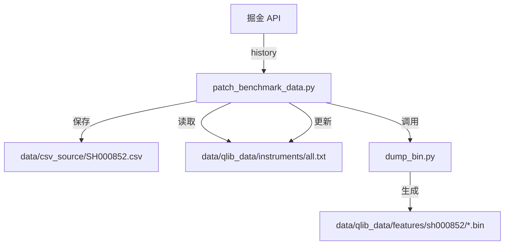

# 2026-03-27 中证1000指数基准数据补充补丁设计

## 1. 背景
目前的 `build_qlib_data.py` 脚本使用按年份分区的 Parquet 文件作为输入。如果某一年份的文件已存在，系统会跳过该年份的下载和处理。由于之前未将中证1000指数 (SHSE.000852) 加入下载列表，导致即使修改了下载脚本，基准数据也难以通过现有自动化流水线快速补齐。

## 2. 目标
开发一个临时补丁脚本 `data/scripts/patch_benchmark_data.py`，实现：
1. 独立下载中证1000指数全量历史数据。
2. 转换为 Qlib 兼容的 CSV 格式。
3. 更新 Qlib 的元数据（instruments 和 calendars）。
4. 增量将数据转存为 Qlib 二进制格式。

## 3. 详细设计

### 3.1 数据流

### 3.2 字段映射
| 掘金原始字段 | 目标列名 | 处理逻辑 |
| :--- | :--- | :--- |
| `symbol` | `symbol` | `SHSE.000852` -> `SH000852` |
| `bob` | `date` | 转为 `YYYY-MM-DD` 字符串 |
| `open` | `open` | 保持不变 |
| `high` | `high` | 保持不变 |
| `low` | `low` | 保持不变 |
| `close` | `close` | 保持不变 |
| `volume` | `volume` | 保持不变 |
| `amount` | `amount` | 保持不变 |

### 3.3 关键步骤实现细节
1. **下载逻辑**：使用 `history` 接口，起始时间固定为 `2015-01-01`，避免遗漏历史基准。
2. **元数据同步**：
   - 更新 `instruments/all.txt`：格式为 `SH000852\t2015-01-05\t2026-03-25`。
   - 更新 `calendars/day.txt`：提取 CSV 中的日期并与现有日历合并、排序、去重。
3. **Dump Bin 调用**：
   使用 `subprocess` 调用 `python dump_bin.py dump_all`，参数：
   - `--include_fields`: `open,high,low,close,volume,amount`
   - `--symbol_field_name`: `symbol`

## 4. 交付物
- `data/scripts/patch_benchmark_data.py`
- 修改后的 `data/qlib_data` 元数据文件
- 生成的 `sh000852` 二进制特征文件
